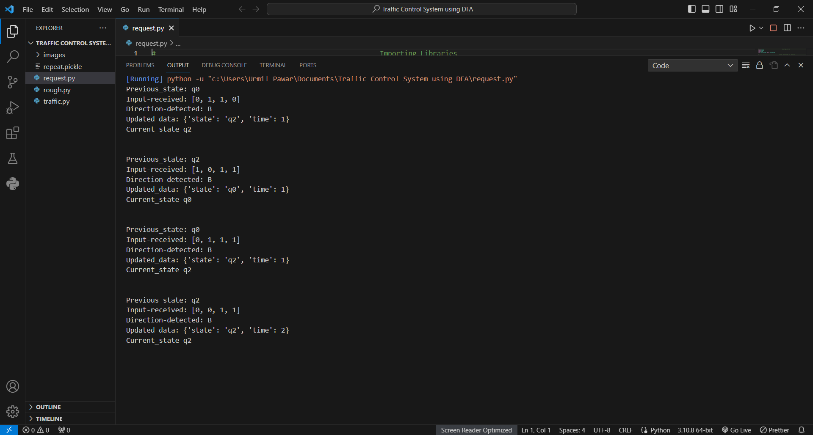

# Traffic-control-system-using-DFA
This project is an attempt to create a traffic control system with the help of deterministic finite automata which will adaptively handle the traffic by considering in which direction cars are present currently.

The project is implemented in Python:
The following are the points which are taken into consideration while developing the project:
1. Checking the validity of input data to ensure accurate processing. 
2. Maintaining a safe state if there is any problem with the sensors.
2. Consideration of Emergency vehicles like Ambulance, Firebrigade and Police cars.
3. Preventing Unnecessary delays and avoiding wastage of time on empty roads.
4. Avoid biasing towards a single direction to ensure a more balanced flow during heavy traffic.
5. Easy  integration into real-world scenarios.

# Designing the DFA:
### Finite Set of States (Q):
- q0  : L1 is green and rest all three are red
- q1  : L2 is green and rest all three are red 
- q2   : L3 is green and rest all three are red
- q3   : L4 is green and rest all three are red
- q4    : All signals are red.

### Input Symbols:
- V: Traffic is detected in at least one vertical lane (North, South, North-South)
- H: Traffic is detected in at least one horizontal lane (East, West, East-West)
- B: Traffic is detected in at least one vertical and horizontal lane(North-East, East-South, North-East-South, North-East-West-South, etc.) 
- N: Traffic is detected in none of the direction.

### Meaning of the output:
- Previous State : The state in which the system previous was
- Input Received : A 4 element array(list) of form [North East South West] where 1 indicates the presence of traffic from the direction, 2 indicates the presence of an emergency vehicle from the direction and 0 indicates no traffic
- Direction Detected : The Input symbol(direction) determined by the system from the input traffic directions
- Updated data : The new determined state and number of times it has occured
- Current State : The current updated state 

# Images of Output

# Documentation
Please refere this document for more detailed explaination:

[Documentation](
https://docs.google.com/document/d/16tYTZZ5Ewma_ZG25JxgfRKfh6fy3FYo5/edit?usp=sharing&ouid=100036865083389644506&rtpof=true&sd=true)
